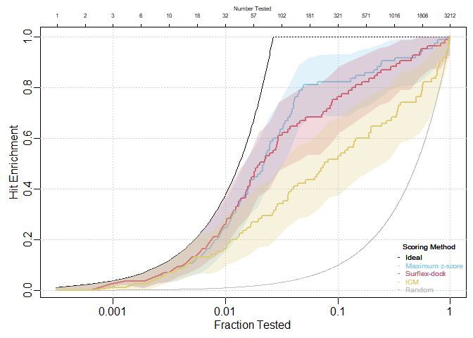
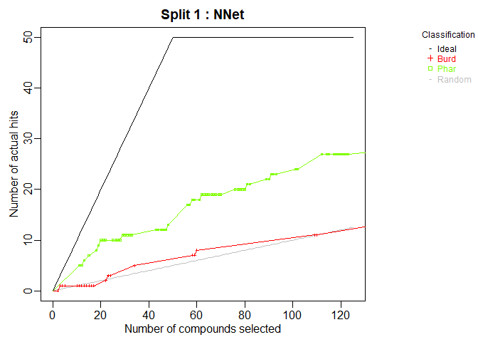
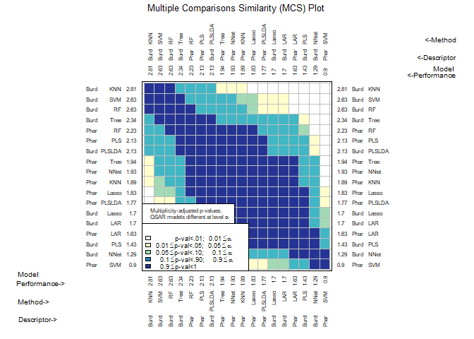

<!-- README.md is generated from README.Rmd. Please edit that file -->
Overview
========

`chemmodlab` contains a suite of methods for fitting machine learning models and methods for validating the resulting models:

-   `ModelTrain()` fits a series of classification or regression models to sets of descriptors and computes cross-validated measures of model performance. Repeated k-fold cross validation is performed with multiple, different fold assignments for the data ("splits").
-   `MakeModelDefaults()` makes a list containing the default parameters for all models implemented in ModelTrain.
-   `plot.chemmodlab()` takes a chemmodlab object output by the `ModelTrain` function and creates a series of accumulation curve plots for assesing model and descriptor set performance.
-   `Performance()` can evaluate many performance measures across all splits created by `ModelTrain`, then outputs a data frame for each D-M combination.
-   `CombineSplits()` evaluates a specified performance measure across all splits created by `ModelTrain` and conducts statistical tests to determine the best performing descriptor set and model (D-M) combinations.
-   `chemmodlab()` is the constructor for the chemmodlab object.

    The statistical methodologies comprise a comprehensive collection of approaches whose validity and utility have been accepted by experts in the Cheminformatics field. As promising new methodologies emerge from the statistical and data-mining communities, they will be incorporated into the laboratory. These methods are aimed at discovering quantitative structure-activity relationships (QSARs). However, the user can directly input their own choices of descriptors and responses, so the capability for comparing models is effectively unlimited.

Installation
============

``` r
# install from CRAN
install.packages("chemmodlab")

# Or use the development from GitHub:
# install.packages("devtools")
devtools::install_github("jrash/chemmodlab")
```

Usage
=====

``` r
library(chemmodlab)

data(aid364)
cml <- ModelTrain(aid364, ids = TRUE, xcol.lengths = c(24, 147),
                  des.names = c("BurdenNumbers", "Pharmacophores"))
plot(cml, splits = 1, meths = c("NNet", "KNN"))
```



``` r
CombineSplits(cml, metric = "enhancement", m = 100)
```


