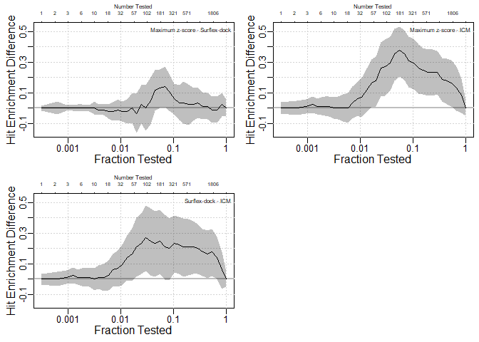
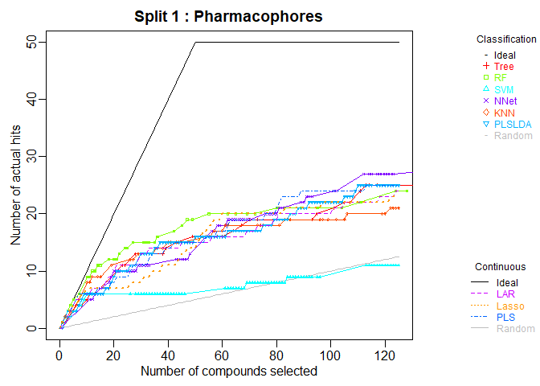
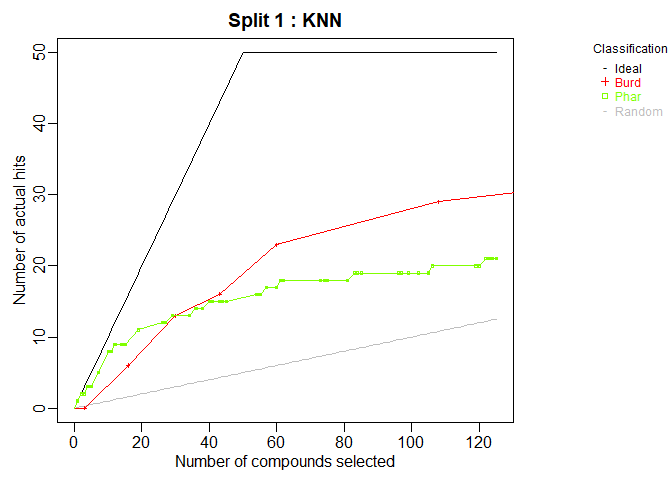

<!-- README.md is generated from README.Rmd. Please edit that file -->

# chemmodlab

`chemmodlab` contains a suite of methods for fitting machine learning
models and for validating the resulting models. The methods are tailored
to virtual screening for drug discovery applications and include
confidence bands and hypothesis tests for hit enrichment curves.

# Installation

    # install from CRAN
    install.packages("chemmodlab")

    # Or use the development from GitHub:
    # install.packages("devtools")
    devtools::install_github("jrash/chemmodlab")

# Usage

Usage is divided into two sections:

1.  [Confidence bands and hypothesis tests for hit enrichment
    curves](https://github.com/jrash/chemmodlab#1-confidence-bands-and-hypothesis-tests-for-hit-enrichment-curves)
2.  [Generalized model fitting and
    evaluations](https://github.com/jrash/chemmodlab#2-generalized-model-fitting-and-evaluations)

## 1. Confidence bands and hypothesis tests for hit enrichment curves

NOTES: 

1. This functionality is not on CRAN yet, but will be soon.  Please download the development branch from github.
2. The confidence band and hypothesis test functions do not require
models to be fit in chemmodlab. Score and activity information can be
provided from any model.

### Confidence bands for individual curves

    library(chemmodlab)

    data(pparg)

    HitEnrich(S.df = pparg[,c(14,2,5)],
              y = pparg[,3], labels = c("Maximum z-score","Surflex-dock", "ICM"),
              log = T, conf = T, conf.level = .95)

<!-- -->

### Confidence bands for differences between curves

All pairwise differences between three methods are shown:

    par(mfrow = c(2, 2))

    HitEnrichDiff(S.df = pparg[,c(14,2,5)], y = pparg[,3], x.max = NULL, labels =
                    c("Maximum z-score","Surflex-dock", "ICM"),
                  log = T, conf.level = .95)

<!-- -->

### Hypothesis tests at specific fractions

    n <- nrow(pparg)
    tested <- c(3,32,321)
    ntested <- length(tested)
    PerfCurveTest( S1=pparg$maxz_scores, S2=pparg$surf_scores,
                   X=pparg$surf_actives, r=tested/n, alpha=.05)
    #> $diff_estimate
    #> [1]  0.00000000 -0.01176471  0.05882353
    #> 
    #> $std_err
    #> [1] 0.005366091 0.023740011 0.029532874
    #> 
    #> $ci_interval
    #>               [,1]       [,2]
    #> [1,] -0.0105173443 0.01051734
    #> [2,] -0.0580238186 0.03503531
    #> [3,] -0.0004121052 0.11535463
    #> 
    #> $p_value
    #> [1] 1.00000000 0.62020172 0.04639319

## 2. Generalized model fitting and evaluations

-   `ModelTrain()` fits a series of classification or regression models
    to sets of descriptors and computes cross-validated measures of
    model performance. Repeated k-fold cross validation is performed
    with multiple, different fold assignments for the data (“splits”).

-   `MakeModelDefaults()` makes a list containing the default parameters
    for all models implemented in ModelTrain.

-   `plot.chemmodlab()` takes a chemmodlab object output by the
    `ModelTrain` function and creates a series of accumulation curve
    plots for assesing model and descriptor set performance.

-   `Performance()` can evaluate many performance measures across all
    splits created by `ModelTrain`, then outputs a data frame for each
    D-M combination.

-   `CombineSplits()` evaluates a specified performance measure across
    all splits created by `ModelTrain` and conducts statistical tests to
    determine the best performing descriptor set and model (D-M)
    combinations.

-   `chemmodlab()` is the constructor for the chemmodlab object.

    The statistical methodologies comprise a comprehensive collection of
    approaches whose validity and utility have been accepted by experts
    in the Cheminformatics field. As promising new methodologies emerge
    from the statistical and data-mining communities, they will be
    incorporated into the laboratory. These methods are aimed at
    discovering quantitative structure-activity relationships (QSARs).
    However, the user can directly input their own choices of
    descriptors and responses, so the capability for comparing models is
    effectively unlimited.

<!-- -->

    library(chemmodlab)

    data(aid364)
    cml <- ModelTrain(aid364, ids = TRUE, xcol.lengths = c(24, 147),
                      des.names = c("BurdenNumbers", "Pharmacophores"))
    plot(cml, splits = 1, meths = c("NNet", "KNN"))

<!-- --><!-- --><!-- --><!-- -->

    CombineSplits(cml, metric = "enhancement", m = 100)

<!-- -->
